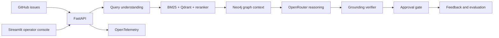

# IncidentRAG

IncidentRAG is an evidence-grounded incident-triage backend. Its GitHub integration can
manually fetch public issues from `argoproj/argo-cd`, rank at most two suitable bug reports,
and submit a selected issue to the existing IncidentRAG assessment pipeline.

This is AI-assisted technical triage based on public issue content and available runbook
evidence. It is not an official Argo CD maintainer diagnosis.

## Architecture



## Run locally

```powershell
docker compose up -d neo4j qdrant redis
.\.venv\Scripts\uvicorn.exe incidentrag.api.app:app --host 0.0.0.0 --port 8000
```

Open `http://localhost:8000/docs` for the interactive API documentation or check:

```powershell
Invoke-RestMethod http://localhost:8000/health
```

Start the operator console in another terminal:

```powershell
.\.venv\Scripts\streamlit.exe run src\incidentrag\approval\ui\streamlit_app.py
```

Then open `http://localhost:8501`.

## GitHub configuration

The source is fixed to Argo CD by default. Public issue reads work without a token. A token
can raise GitHub's rate limit but is optional.

```env
GITHUB_OWNER=argoproj
GITHUB_REPO=argo-cd
GITHUB_TOKEN=
GITHUB_MAX_RESULTS=2
GITHUB_CANDIDATE_LIMIT=10
GITHUB_UPDATED_WITHIN_DAYS=90
GITHUB_API_BASE_URL=https://api.github.com
GITHUB_REQUEST_TIMEOUT_SECONDS=10
DEMO_MODE=true
EXECUTION_ENABLED=false
```

Never commit `.env` or place a real token in logs, API requests, screenshots, or documents.

## OpenRouter configuration

OpenRouter is the preferred provider for query understanding, assessment generation,
grounding, and vector embeddings. Put the key in the local `.env` file:

```env
OPENROUTER_API_KEY=sk-or-v1-your-key
OPENROUTER_BASE_URL=https://openrouter.ai/api/v1
OPENROUTER_UTILITY_MODEL=openai/gpt-4o-mini
OPENROUTER_REASONING_MODEL=openai/gpt-4o-mini
OPENROUTER_EMBEDDING_MODEL=openai/text-embedding-3-small
```

The embedding model returns 1536 dimensions and therefore matches
`QDRANT_EMBEDDING_DIM=1536`. If `OPENROUTER_API_KEY` is empty, IncidentRAG falls back to
`OPENAI_API_KEY`. Restart the FastAPI process after changing `.env`.

## Manual GitHub issue workflow

Check source status:

```bash
curl http://localhost:8000/sources/github/status
```

Fetch cached label metadata:

```bash
curl http://localhost:8000/sources/github/labels
```

Fetch up to two suitable open bugs:

```bash
curl "http://localhost:8000/sources/github/issues?component=repo-server&updated_days=90&limit=2"
```

Fetch one issue without analysing it:

```bash
curl "http://localhost:8000/sources/github/issues/12345?include_comments=false"
```

Explicitly analyse a selected issue:

```bash
curl -X POST http://localhost:8000/sources/github/issues/12345/analyze
```

Analysis is currently synchronous. The response contains the incident ID, truthful stage
history, sanitized source facts, AI hypotheses, retrieved evidence, investigation and
remediation recommendations, approval requirements, the structured assessment, model cost,
and the triage disclaimer.

GitHub rate-limit metadata includes only remaining requests and reset time. Rate-limit errors
return HTTP 429; timeouts return 504; permission errors return 401/403; missing issues return
404; malformed upstream responses return 502.

## Security boundaries

- GitHub access is read-only and only targets the configured repository.
- Fetching and analysing are separate, explicit user actions. There is no polling.
- Pull requests, feature requests, release tracking, stale issues, and empty issue bodies are
  excluded from candidate results.
- Issue content is untrusted. HTML is removed; likely credentials, private keys, and email
  addresses are redacted; text lengths are bounded before model use.
- URLs embedded in issue text are not fetched.
- Commands from issues are evidence only and are never executed.
- API-created pipelines run in dry-run mode while `EXECUTION_ENABLED=false`, which is the
  default.

## AWS deployment

Deployment assets are under `deploy/`. The Helm chart targets an existing EKS cluster and
expects private Neo4j, Qdrant, Redis, and OpenTelemetry endpoints. Terraform provisions ECR
repositories, a Secrets Manager container, and a CloudWatch log group. Follow
`deploy/README.md`; deploy to staging first and keep execution disabled.
